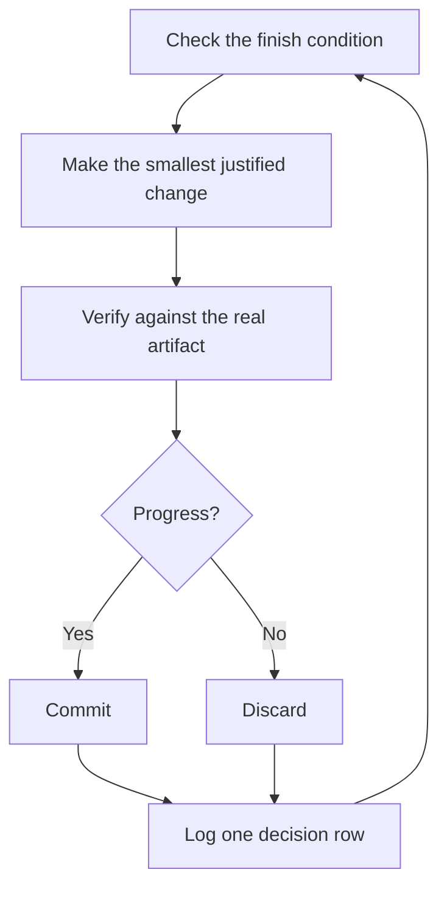

# Run work while you sleep

Unattended work needs a checkable finish condition, an isolated worktree, and a decision log. It also needs a host wake mechanism that will actually run after the current session ends. Confirm that mechanism before expecting a morning result.


## The overnight contract

A good handoff has the goal, the finish condition, permissions, and an escape hatch. It doesn't need to be long:

```text
/poteto-mode im going to bed. migrate every caller to the new parser in a fresh worktree off <base>.
done means zero old callers, all parser fixtures pass, old api deleted.
keep a decision log. don't ask me before committing.
if the host supports a scheduled continuation, configure it for this task. otherwise leave a resumable checkpoint when this session ends.
```

Walk through what each line buys you:

- "im going to bed" explains when you expect to review the result. It does not create a background worker.
- "done means..." turns the goal into checks every iteration can run.
- "fresh worktree off `<base>`" keeps the run from colliding with anything else you have open.
- "don't ask me before committing" pre-answers the permission the agent would otherwise block on.
- The [Autonomous run playbook](../../plugins/pstack/skills/poteto-mode/playbooks/autonomous-run.md) uses an actual host-supported wake mechanism when one is available. Use a Codex or Grok Build scheduled or monitoring feature only when configured and available; otherwise stop at a checkpoint that another session can resume.
- The escape hatch lets it stop at a genuine dead end and write up why, which beats eight hours of creative goal reinterpretation.

Because you'll review this work after stepping away, `/poteto-mode` routes it through [`/figure-it-out`](../../plugins/pstack/skills/figure-it-out/SKILL.md), which designs the run's phases before any code and wires in the decision log.

## What the loop does all night



One change, one check, one log row, every iteration. Changes that didn't help get discarded, not left to ride. A plateau means pivot, not stop, and the finish condition never quietly relaxes to declare victory.

## The morning audit

[`/show-me-your-work`](../../plugins/pstack/skills/show-me-your-work/SKILL.md) is what makes the run reviewable. Each row records the time, phase, decision, reason, an evidence pointer, and the result, in a TSV at `decisions.tsv` (or `.audit/<task-slug>.tsv` when several runs share a directory). It stays local by default. Commit it when the work is ambitious enough that a reviewer needs the trail to trust the result.

When you're back, ask for the run in review form:

```text
/show-me-your-work catch me up on what you did last night
```

When a transcript and independent reviewer are available, the skill audits the trail against both. Otherwise it checks the evidence it can access and labels the missing review. Read the Attention section and the log rows it points at.

**Pitfall:** a duration is not a finish condition. Give any continuation mechanism a predicate that can pass or fail.

Next: [Steer with principle names](./08-principles.md).
